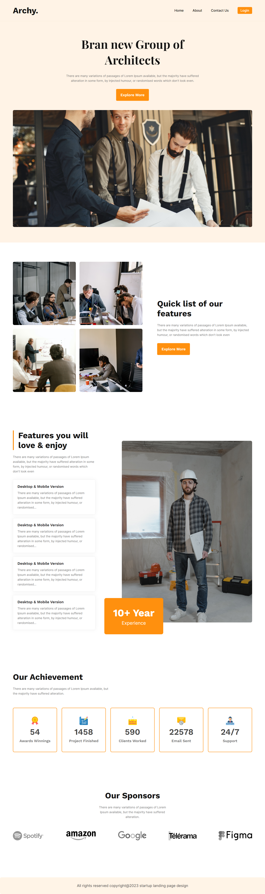
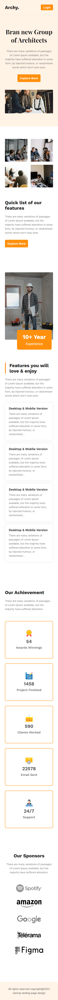

# G3 Architect Website Practice

This a practice task from [Programming Hero](https://github.com/ProgrammingHero1)
 
Programming Hero Course • Milestone 2 • Module 9 • Practice Tasks
 
Live preview: https://ikramhussainsiyam.github.io/Responsive-g3-architects-website/

# Screenshot preview

## Desktop view

## Laptop view

## Big Tablet

## Small Tablet

## Phone View
